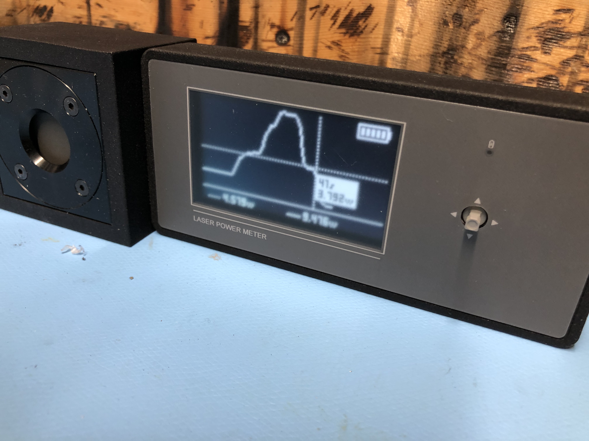

# LPM
LPM is a laser power meter used for reading the output power of a laser. It is designed to use a power sensor from Ophir, but any sensor that can produce a linear voltage related to power can be used.  It supplies +12 and -12 volt supplies to the sensor to power it, if needed.

## Features
* 24 bit ADC for precision
* Logging to onboard 64KB flash memory
* Logs viewable graphically and can be output to PC using built-on USB serial port
* Rechargeable battery through USB-C connector
* Software calibration can use any sensor

_(note - the Eagle files included in this repo do not need the jumper and resistor hacks you see here.  They've been fixed)_

### Calibration
The board must be calibrated before use.  This can be done through the menu.  Connect a stable voltage source to the sensor input (11.5 volts maximum) and enter the calibration menu.  This will display six digits (###.###), and represents the laser power level at that voltage for the sensor you plan to use.  Use the D-Pad to adjust the digits and click down to accept.

### Usage
Clicking down on the D-Pad turns the unit on. There is an automatic sleep of 10 minutes of inactivity.  Sleep is disabled during logging. Pressing right, left, select or on the D-Pad enters the menu. From here you can zero the max and averages, configure logging cadence or view the log if it exists.  There are also two short-cuts:  down zeros the max and averages and up starts / stops logging. Pressing and holding in the D-Pad for two seconds turns the unit off.

### Logging
When in logging view you can position the cursor using left and right to show the value at that location.  The log can be sent through USB -- the LPM shows up as a serial port, so you need your own software to pull the log data off.

## Case
I've also included the CAD files (IGES format) of a case that fits this.  I decided to make the sensor and display all part of the same unit so I can just throw it in my toolbox and not have to worry about a bunch of wires.
